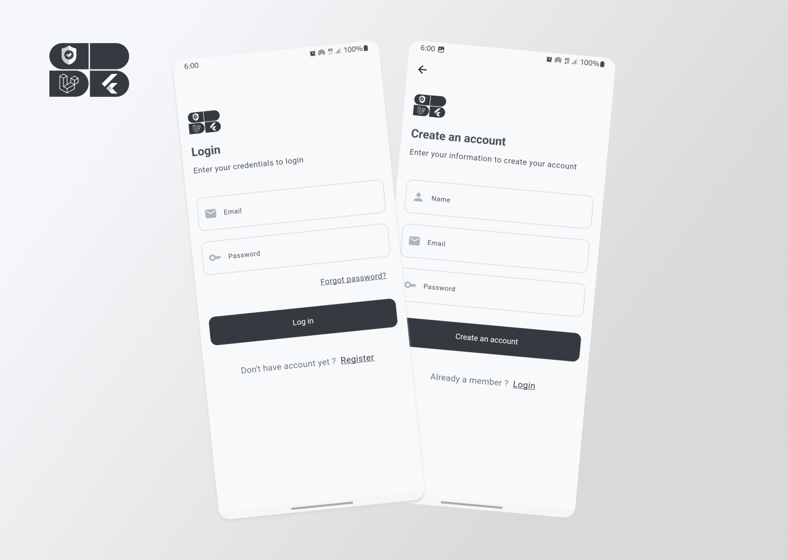

## Flutter & Laravel Authentication Starter Template

This repository provides a foundation for building mobile applications with Flutter that leverage Laravel's robust authentication features. It currently offers essential functionalities like login, registration, and logout, serving as a solid starting point for your project.


## Screenshots




## Features

* **Flutter Mobile App:**
    * User-friendly interface for login, registration, and logout.
    * Secure communication with the Laravel API.
* **Laravel Backend:**
    * Laravel authentication scaffolding for user management.
    * Secure API endpoints for authentication actions.


## Installation

**Prerequisites:**

* Flutter development environment set up (https://docs.flutter.dev/)
* Composer installed (https://getcomposer.org/doc/faqs/how-to-install-composer-programmatically.md)
* A Laravel project (https://laravel.com/docs/11.x/installation)

**Setup:**

1. **Clone the repository:**

   ```bash
   git clone https://github.com/53NX-8/laravel-flutter-auth.git

2. **Navigate to the Flutter directory:**

   ```bash
   cd flutter_app

3. **Install dependencies:**

    ```bash
   flutter pub get

4. **Navigate to the Laravel directory:**

    ```bash
   cd ../laravel_api

5. **Install Laravel dependencies:**

    ```bash
   composer install
   php artisan key:generate

6. **Configure database connection:**

* Edit the .env file in the Laravel root directory.
* Update database connection details (host, database, username, password)

7. **Migrate Laravel database:**

    ```bash
   php artisan migrate
   php artisan serve
## Usage

The Flutter app provides login, registration, and logout functionalities through its user interface. These actions communicate with the Laravel API for authentication purposes.

Note: This is a starter template. The specific implementation details may vary depending on your project's requirements.
## Contributing

Contributions are always welcome!

We welcome contributions to improve this project. Feel free to submit pull requests with enhancements or bug fixes.


## License

This project is licensed under the [MIT License.](https://choosealicense.com/licenses/mit/)

